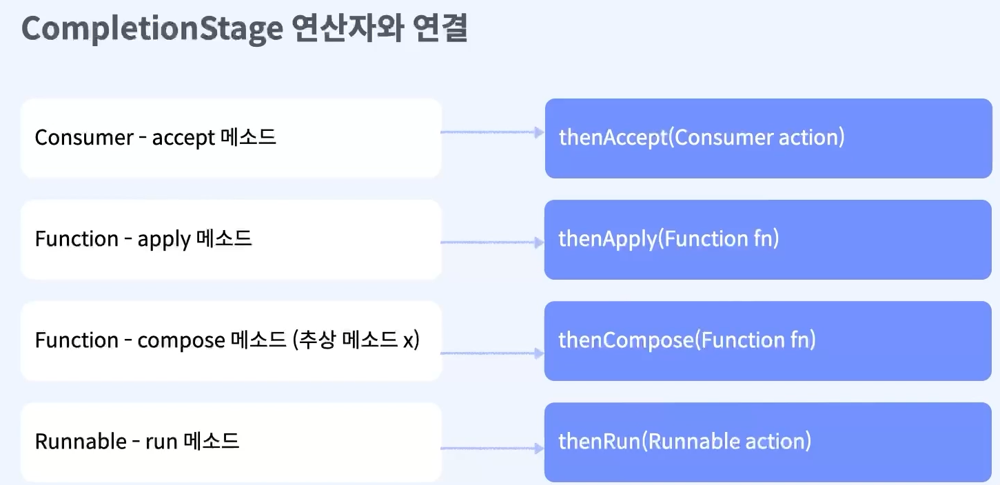
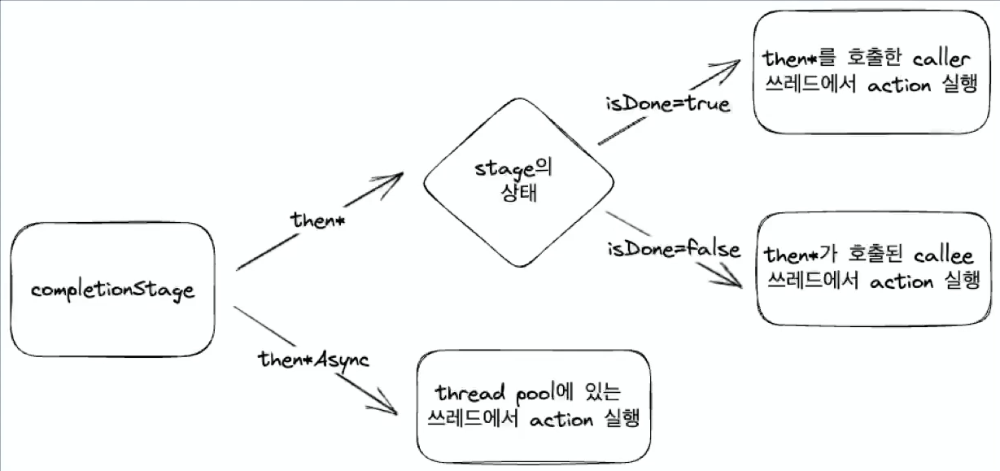

# CompletionStage


## 1. CompletionStage 인터페이스
```java
public interface CompletionStage<T> {
    public <U> CompletionStage<U> thenApply(Function<? super T,? extends U> fn);
    public <U> CompletionStage<U> thenApplyAsync(Function<? super T,? extends U> fn);

    public CompletionStage<Void> thenAccept(Consumer<? super T> action);
    public CompletionStage<Void> thenAcceptAsync(Consumer<? super T> action);

    public CompletionStage<Void> thenRun(Runnable action);
    public CompletionStage<Void> thenRunAsync(Runnable action);

    public <U> CompletionStage<U> thenCompose(Function<? super T, ? extends CompletionStage<U>> fn);
    public <U> CompletionStage<U> thenComposeAsync(Function<? super T, ? extends CompletionStage<U>> fn);
}
```

---

<br>
<br>


## 2. CompletionStage 연산자 조합
- 50개에 가까운 연산자들을 활용하여 비동기 task들을 실행하고 값을 변형하는 등 chaining을 이용한 조합이 가능
- 에러를 처리하기 위해 콜백제공

```java
import java.util.concurrent.CompletableFuture;

public class CompletionStageTest {
    public static void main(String[] args) {
        CompletableFuture.completedFuture("Hello")
                .thenApplyAsync(value -> value + " word")
                .thenAccept(value -> System.out.println(value))
                .thenRunAsync(() -> System.out.println("thenRun"))
                .exceptionally(e -> {
                    System.out.println(e.getMessage());
                    return null;
                });
    }
}
```  



<br>

### 2-1 thenAccept [Async]
- Consumer를 파라미터로 받는다.
- 이전 task로부터 값을 받지만 값을 넘기지 않는다.
- 다음 task에게 null이 전달된다.
- 값을 받아서 action만 수행하는 경우 유용

#### done 상태의 thenAccept 
> 테스트를 위한 Helper 클래스 생성 
```java
    public static class Helper {

        /**
         * 1를 반환하는 완료된 CompletableFuture 반환
         */
        public static CompletionStage<Integer> finishedStage() {
            return CompletableFuture.supplyAsync(() -> {
                System.out.println("supplyAsync");
                return 1;
            });
        }

        /**
         * 1초를 sleep 한 후 1을 반환하는 메소드
         */
        public static CompletionStage<Integer> runningStage() {
            return CompletableFuture.supplyAsync(() -> {
                try {
                    Thread.sleep(1000);

                    System.out.println("I' m running");
                } catch (InterruptedException e) {
                    System.out.println(e.getMessage());
                }
                return 1;
            });
        }
    }
```

<br>

```java
public class CompletionStageTest {
    public static void main(String[] args) throws InterruptedException {
        CompletionStage<Integer> stage = Helper.finishedStage();
        logger.log(Level.INFO, "startMain");

        stage.thenAccept(i -> logger.log(Level.INFO, "thenAccept1 : " + i))
                .thenAccept(i -> logger.log(Level.INFO, "thenAccept2 : " + i));

        logger.log(Level.INFO, "after thenAccept");
    }
}
/*
        supplyAsync
        log - startMain
        log - thenAccept1 : 1
        log - thenAccept2 : null
        log - after thenAccept
 */

```

<br>

#### done 상태의 thenAcceptAsync
```java
public class CompletionStageTest {
    public static void main(String[] args) throws InterruptedException {
        logger.log(Level.INFO, "startMain");
        CompletionStage<Integer> stage2 = Helper.finishedStage();
        stage2.thenAcceptAsync(i -> logger.log(Level.INFO, "thenAcceptAsync1 : " + i))
                .thenAcceptAsync(i -> logger.log(Level.INFO, "thenAcceptAsync2 : " + i));
        logger.log(Level.INFO, "after thenAcceptAsync");
    }
}
/*
        log - startMain
        supplyAsync
        log - thenAcceptAsync1 : 1
        log - after thenAcceptAsyncs
        log - thenAcceptAsync2 : null
 */

```

<br>

#### running 중인  thenAccept
```java
public class CompletionStageTest {
    public static void main(String[] args) throws InterruptedException {
        CompletionStage<Integer> stage = Helper.runningStage();
        logger.log(Level.INFO, "startMain");
        stage.thenAccept(i -> logger.log(Level.INFO, "thenAccept1 : " + i))
                .thenAccept(i -> logger.log(Level.INFO, "thenAccept2 : " + i));
        Thread.sleep(2000);
    }
}
/*
        log - startMain
        I' m running
        log - thenAccept1 : 1
        log - thenAccept2 : null
 */

```

<br>

#### running 중인  thenAcceptAsync
```java
public class CompletionStageTest {
    public static void main(String[] args) throws InterruptedException {
        logger.log(Level.INFO, "startMain");
        CompletionStage<Integer> stage2 = Helper.runningStage();
        stage2.thenAcceptAsync(i -> logger.log(Level.INFO, "thenAcceptAsync : " + i))
                .thenAcceptAsync(i -> logger.log(Level.INFO, "thenAcceptAsync : " + i));

        Thread.sleep(2000);
    }
}
/*
        log - startMain
        I' m running
        log - thenAccept1 : 1
        log - thenAccept2 : null
 */

```

<br>


#### then*Async의 쓰레드 풀 변경
- 모든 then*Async 연산자는 executor를 추가인자로 받는다.
- 이를 통해서 다른 쓰레드풀로 task를 실행할 수 있다.
```java
ExecutorService newFixedThreadPool = Executors.newFixedThreadPool(10);
ExecutorService newSingleThreadExecutor = Executors.newSingleThreadExecutor();

logger.log(Level.INFO, "start");
CompletionStage<Integer> stage3 = Helper.finishedStage();
stage3.thenAcceptAsync(i -> {
            logger.log(Level.INFO, "thenAcceptAsync1 : " + i);
        }, newFixedThreadPool)
        .thenAcceptAsync(i -> {
            logger.log(Level.INFO, "thenAcceptAsync : " + i);
        }, newSingleThreadExecutor);

Thread.sleep(2000);
```


<br>

#### 정리 
- done 상태
> done 상태에서는 caller(main) 쓰레드에서 실행이된다.    
> done 상태의 completionStage에 thenAccept를 사용하는 경우, caller 쓰레드를 block 할 수 있다.
- running 상태
> thenAccept는 callee(forkJoinPool)의 쓰레드에서 실행  
> done 상태가 아닌 completionStage에 thenAccept를 사용할 경우 callee를 block할 수 있다.

- then* [Async]의 실행 쓰레드
> then* 는 stage 상태에 따라 caller 및 callee 쓰레드에서 실행된다.
> then* Async는 thredd pool에 있는 쓰레드에서 action 실행된다.



<br>

### 2-2 thenApplyAsync
- Function을 파라미터로 받는다.
- 이전 task로부터 T타임의 값을 받아서 가공하고 U타입 값을 반환한다.
- 다음 task에게 반환했던 값이 전달된다.
- 값을 변형해서 전달해야 하는 경우 유용


```java
/**
 * thenApplyAsync
 * */
CompletionStage<Integer> stage4 = Helper.finishedStage();

stage4.thenApplyAsync(i -> {
            int value = i + 1;
            System.out.println(value);
            return value;
        }).thenApplyAsync(i -> {
            String value = "result" + i;
            return value;
        })
        .thenAcceptAsync(i -> System.out.println(i));
```
<br>

### 2-3 thenCompose[Async]
- Function을 파라미터로 받는다.
- 이전 task로부터 T타입의 값을 받아서 가공하고 U타입의 CompletionStage를 반환한다.
- 반환한 CompletionStage가 done상태가 되면 값을 다음 task에 전달한다.
- 다른 future를 반환해야하는 경우 유용

```java
        /**
         * int를 받아 +1 하는 메소드
         */
        public static CompletionStage<Integer> addOne(int value) {
            return CompletableFuture.supplyAsync(() -> {
                try {
                    Thread.sleep(1000);

                    System.out.println("I' m running");
                } catch (InterruptedException e) {
                    System.out.println(e.getMessage());
                }
                return value + 1;
            });
        }

        /**
         * int를 받아 +1 하는 메소드
         */
        public static CompletionStage<String> addResultPrefix(int value) {
            return CompletableFuture.supplyAsync(() -> {
                try {
                    Thread.sleep(1000);
                } catch (InterruptedException e) {
                    System.out.println(e.getMessage());
                }
                return "Result : " + value;
            });
        }
```

<br>

```java
CompletionStage<Integer> stage5 = Helper.finishedStage();
stage5.thenComposeAsync(i -> {
            CompletionStage<Integer> integerCompletionStage = Helper.addOne(i);
            return integerCompletionStage;
        })
        .thenComposeAsync(i -> Helper.addResultPrefix(i))
        .thenAcceptAsync(i -> System.out.println(i));
Thread.sleep(2000);

/*
        supplyAsync
        Result : 2
 * */
```

<br>

### 2-4 thenRun[Async]
- Runnable을 파라미터로 받는다.
- 이전 task로부터 값을 받지 않고 값을 반환하지 않는다.
- 다음 task에게 null이 전단된다.
- future가 완료되었다는 이벤트를 기록할 때 유용


```java
/**
 * ThenRunAsync
 * */
CompletionStage<Integer> stage6 = Helper.finishedStage();
stage6.thenRunAsync(() -> System.out.println("thenRunAsync"))
        .thenRunAsync(() -> System.out.println("thenRunAsync2"))
        .thenAcceptAsync(i -> System.out.println(i));
Thread.sleep(2000);

/*
        supplyAsync
        thenRunAsync
        thenRunAsync2
        null
 */
```

<br>

###  2-5 exceptionally
- Function을 파라미터로 받는다.
- 이전 task에서 발생한 exception을 받아서 처리하고 값을 반환한다.
- 다음 task에게 반환된 값을 전달한다.
- future 파이프에서 발행한 에러를 처리할 때 유용


---


<br>
<br>

## ForkJoinPool - thread pool
- CompletableFuture는 내부적으로 비동기 함수들을 실행하기 위해 ForkJoinPool을 사용
- ForkJoinPool의 기본 size는 할당된 cpu코어 -1 
- 데몬 쓰레드, main 쓰레드가 종료되면 즉각적으로 종료


